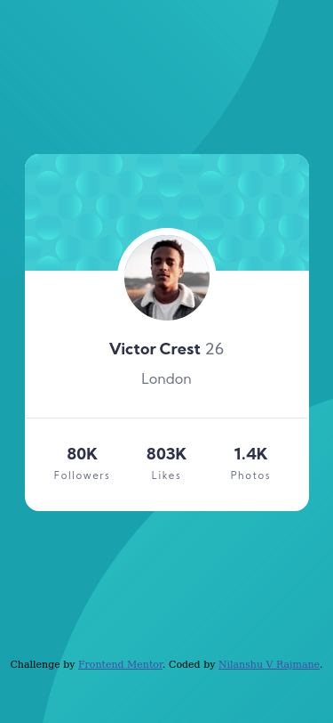

# Frontend Mentor - Profile card component solution

This is a solution to the [Profile card component challenge on Frontend Mentor](https://www.frontendmentor.io/challenges/profile-card-component-cfArpWshJ). Frontend Mentor challenges help you improve your coding skills by building realistic projects. 

## Table of contents

- [Overview](#overview)
  - [The challenge](#the-challenge)
  - [Screenshot](#screenshot)
  - [Links](#links)
- [My process](#my-process)
  - [Built with](#built-with)
  - [What I learned](#what-i-learned)
  - [Continued development](#continued-development)
- [Author](#author)

## Overview

### The challenge

- Build out the project to the designs provided

### Screenshot




### Links

- Solution URL: [Github](https://github.com/nilanshu96/profile-card-component)
- Live Site URL: [Live Website](https://nilanshu96.github.io/profile-card-component/)

## My process

### Built with

- Semantic HTML5 markup
- CSS custom properties
- Flexbox

### What I learned

I learnt how to create a complex background

```css
body {
    background: url('./images/bg-pattern-top.svg') top -30rem left no-repeat, url('./images/bg-pattern-bottom.svg') bottom -30rem right no-repeat,var(--dark-cyan);
}
```

### Continued development

I'll be working on creating more complex layouts

## Author

- Website - [Nilanshu V Rajmane](https://github.com/nilanshu96)
- Frontend Mentor - [@nilanshu96](https://www.frontendmentor.io/profile/nilanshu96)
- Twitter - [@nilanshu96](https://www.twitter.com/nilanshu96)
